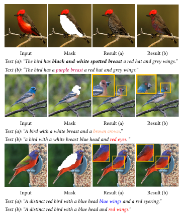

# TDANet: Text-Guided Neural Image Inpainting 
[ArXiv](https://arxiv.org/abs/1903.04227) | [Project Page](http://www.chuanxiaz.com/publication/pluralistic/) | [Online Demo](http://www.chuanxiaz.com/project/pluralistic/) | [Video(demo)](https://www.youtube.com/watch?v=9V7rNoLVmSs)
<br>

This repository implements the training, testing and editing tools for "Pluralistic Image Completion" 
by Lisai Zhang, Qingcai Chen, Baotian Hu and Shuoran Jiang. Given one masked image, the proposed 
**TDANet** is able to generate diverse plausible results according to guidance text.

## Inpainting example


## Manipulation Extension example



# Getting started
## Installation
This code was tested with Pytoch 1.2.0, CUDA 10.1, Python 3.6 and Ubuntu 16.04

- Install Pytoch 1.2.0, torchvision, and other dependencies from [http://pytorch.org](http://pytorch.org)
- Install python libraries [visdom](https://github.com/facebookresearch/visdom) and [dominate](https://github.com/Knio/dominate) for visualization

```
pip install visdom dominate
```
- Clone this repo:

```
git clone https://github.com/idealwhite/tdanet
cd tdanet
```

## Datasets
- ```CUB_200``` original training images from [ImageNet](http://www.image-net.org/).
- ```COCO``` original training images from [ImageNet](http://www.image-net.org/).

## Training
```
python train.py --name tda_bird  --gpu_ids 0 --model tdanet
```
- Set ```--mask_type``` in options/base_options.py for different training masks. ```--mask_file``` path is needed for **object mask**,
 ```--text_config``` refer to the yml configuration file for text setup, ```--img_file``` as the image file dir or file list.
- To view training results and loss plots, run ```python -m visdom.server``` and copy the URL [http://localhost:8097](http://localhost:8097).
- Training models will be saved under the **checkpoints** folder.
- The more training options can be found in **options** folder.

## Testing

```
python test.py --name textualinpainting_mask0124_update-lm_detach-embedding --img_file datasets/coco/valid.flist --results_dir RESULT_DIR --mask_type 4 --no_shuffle --gpu_ids 1 --nsampling 1 --no_variance --text_config config.coco.yml --mask_file ./datasets/coco/image_mask_coco_all.json
```
- Set ```--mask_type``` in options/base_options.py test various masks. ```--mask_file``` path is needed for **object mask**,
 ```--text_config``` refer to the yml configuration file for text setup, ```--img_file``` as the test image file dir or file list.
- The default results will be saved under the *results* folder. Set ```--results_dir``` for a new path to save the result.

## Evaluation

```
python evaluation.py --batch_test 60
```
- Set ```--ground_truth_path``` to the dir of ground truth image path or list. ```--save_path``` as the result dir.


## Pretrained Models
Download the pre-trained models using the following links and put them under```checkpoints/``` directory.

- ```center_mask model```: [CelebA_center](https://drive.google.com/open?id=1zQnFkRAtjGCorOd0Mj9tfdApcAPbs6Kw) | [Paris_center](https://drive.google.com/open?id=1s4zmYhJAdkRErivj3OuTPeQ5ECQtq35e) | [Places2_center](https://drive.google.com/open?id=1y8wE8wcIq8EMRzjgOE3Y_Bv4iPLW4RV3) | [Imagenet_center](https://drive.google.com/open?id=1iH60vWygjk2Gc9iyVAva45vz3meSeZPg)
- ```random_mask model```: [CelebA_random](https://drive.google.com/open?id=1nLq-W7eAZErqsvB1Q8h1yQT_l7_kZBXT) | [Paris_random](https://drive.google.com/open?id=1D67Y1AtsMy_opysxtt06D7vZrDUKvDAm) | [Places2_random](https://drive.google.com/open?id=1L4NAHQqyEJ_ANt4SfEP1hdEVdGrteu4L) | [Imagenet_random](https://drive.google.com/open?id=1hS6D4gjOkvEOlAEOAKxCCzjhpCoddU2S)

Our main novelty of this project is the *multiple* and *diverse* plausible results for one given masked image. The **center_mask models** are trained with images of resolution 256*256 with center holes 128x128, which have large diversity for the large missing information. The **random_mask models** are trained with random regular and irregular holes, which have different diversity for different mask sizes and image backgrounds.

## GUI
Download the pre-trained models from [Google drive](https://drive.google.com/open?id=1lPSKKVy99ECpwzpN3EExdeBxhexwjJEh) and put them under```checkpoints/``` directory.

- Install the [PyQt5](https://pypi.org/project/PyQt5/) for GUI operation

```
pip install PyQt5
```

Basic usage is:
```
python -m visdom.server
python ui_main.py
```

The buttons in GUI:
- ```Options```: Select the model and corresponding dataset for editing.
- ```Bush Width```: Modify the width of bush for free_form mask.
- ```draw/clear```: Draw a ```free_form``` or ```rectangle``` mask for random_model. Clear all mask region for a new input.
- ```load```: Choose the image from the directory.
- ```random```: Random load the editing image from the datasets.
- ```fill```: Fill the holes ranges and show it on the right.
- ```save```: Save the inputs and outputs to the directory.
- ```Original/Output```: Switch to show the original or output image.

The steps are as follows:
```
1. Select a model from 'options'
2. Click the 'random' or 'load' button to get an input image.
3. If you choose a random model, click the 'draw/clear' button to input free_form mask.
4. If you choose a center model, the center mask has been given.
5. click 'fill' button to get multiple results.
6. click 'save' button to save the results.
```

## Next
- Improvement on COCO quality

## License

This software is for educational and academic research purpose only. If you wish to obtain a commercial royalty bearing license to
 this software, please contact us at lisaizhang@foxmail.com.

## Citation
If you use this code for your research, please cite our paper.
```
@inproceedings{tdanet,
  title={Text-Guided Neural Image Inpainting},
  author={Zheng, Chuanxia and Cham, Tat-Jen and Cai, Jianfei},
  booktitle={Proceedings of the 28th ACM International Conference on Multimedia (MM '20)},
  pages={1438--1447},
  year={2020}
}
```
